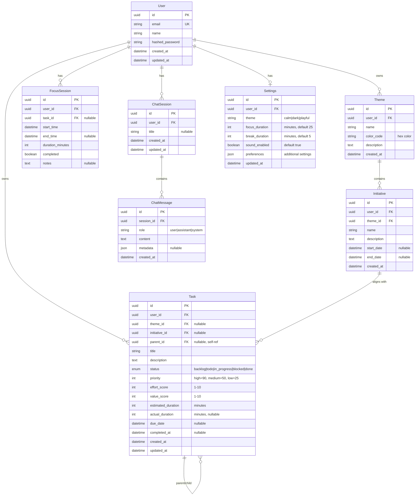
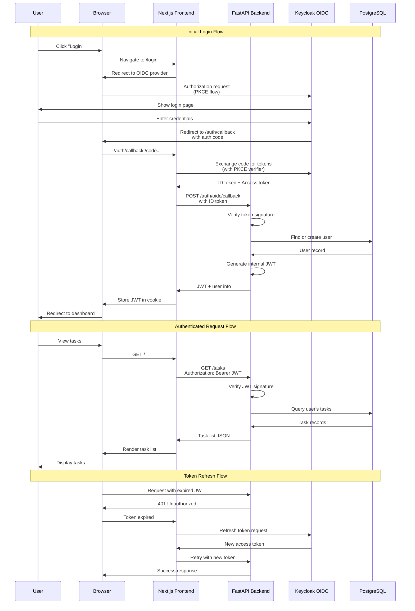
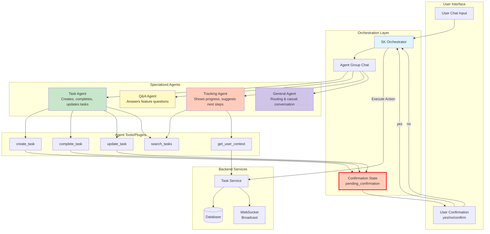
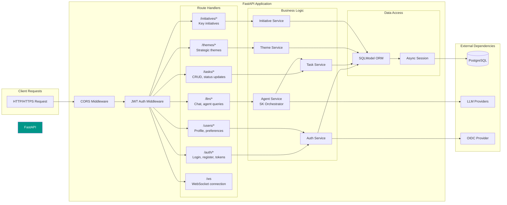
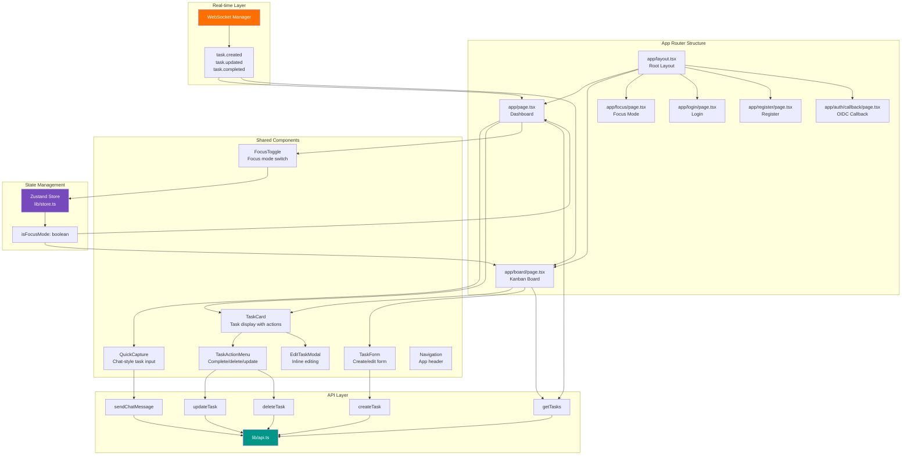
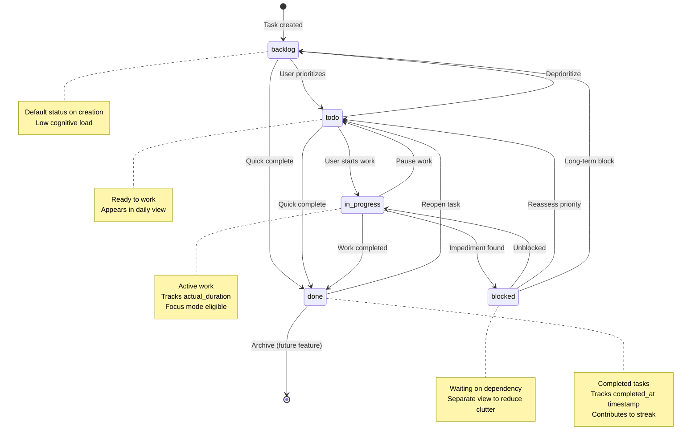
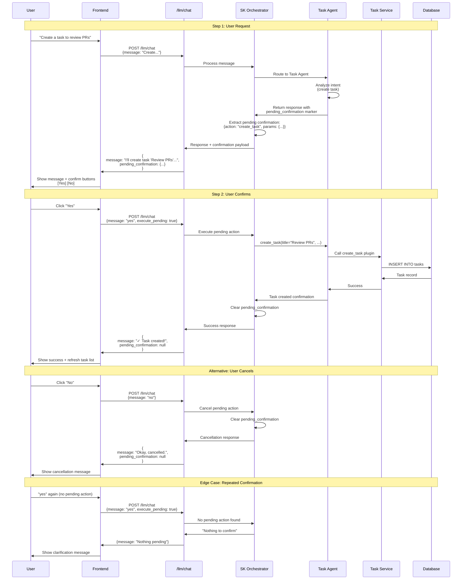
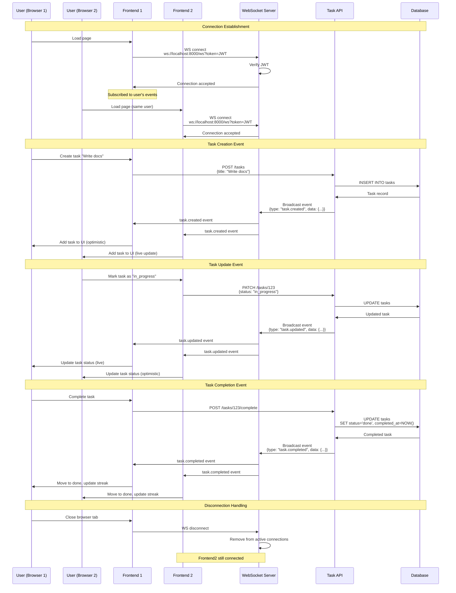
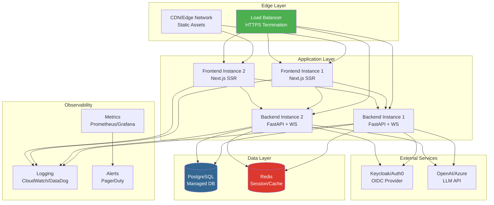

# Liminal Architecture Documentation

This document provides comprehensive architectural diagrams for the Liminal ADHD planner application.

## Table of Contents

1. [System Architecture](#1-system-architecture)
2. [Data Model](#2-data-model-er-diagram)
3. [Authentication Flow](#3-authentication-flow)
4. [AI Agent Orchestration](#4-ai-agent-orchestration-semantic-kernel)
5. [API Architecture](#5-api-architecture)
6. [Frontend Architecture](#6-frontend-architecture)
7. [Task Lifecycle](#7-task-lifecycle-state-machine)
8. [AI Confirmation Flow](#8-ai-confirmation-flow)
9. [Real-time Updates](#9-real-time-updates-websocket)

---

## 1. System Architecture

Overall infrastructure showing all services and their relationships.

```mermaid
graph TB
    subgraph "Client Layer"
        Browser[Web Browser]
    end

    subgraph "Frontend Service"
        NextJS[Next.js 13<br/>App Router]
        WSClient[WebSocket Client]
        OIDC[OIDC Client<br/>oidc-client-ts]
    end

    subgraph "Backend Service"
        FastAPI[FastAPI Application]
        WSServer[WebSocket Server]

        subgraph "API Routers"
            AuthRouter[/auth]
            TaskRouter[/tasks]
            ThemeRouter[/themes]
            InitRouter[/initiatives]
            LLMRouter[/llm]
        end

        subgraph "AI System"
            SKOrch[Semantic Kernel<br/>Orchestrator]
            TaskAgent[Task Agent]
            QAAgent[Q&A Agent]
            TrackAgent[Tracking Agent]
            GenAgent[General Agent]
        end

        subgraph "Data Layer"
            SQLModel[SQLModel ORM]
            AsyncPG[asyncpg Driver]
        end
    end

    subgraph "External Services"
        Keycloak[Keycloak<br/>OIDC Provider]
        AzureOAI[Azure OpenAI]
        OpenAI[OpenAI API]
        Groq[Groq API]
        Ollama[Ollama<br/>Local LLM]
    end

    subgraph "Data Storage"
        PostgreSQL[(PostgreSQL 15<br/>Database)]
        PGVolume[postgres_data<br/>Volume]
    end

    Browser --> NextJS
    Browser --> WSClient
    NextJS --> FastAPI
    WSClient --> WSServer
    NextJS --> OIDC
    OIDC --> Keycloak

    FastAPI --> AuthRouter
    FastAPI --> TaskRouter
    FastAPI --> ThemeRouter
    FastAPI --> InitRouter
    FastAPI --> LLMRouter

    LLMRouter --> SKOrch
    SKOrch --> TaskAgent
    SKOrch --> QAAgent
    SKOrch --> TrackAgent
    SKOrch --> GenAgent

    TaskAgent -.LLM Calls.-> AzureOAI
    TaskAgent -.LLM Calls.-> OpenAI
    TaskAgent -.LLM Calls.-> Groq
    TaskAgent -.LLM Calls.-> Ollama

    QAAgent -.LLM Calls.-> AzureOAI
    QAAgent -.LLM Calls.-> OpenAI

    AuthRouter --> SQLModel
    TaskRouter --> SQLModel
    ThemeRouter --> SQLModel
    InitRouter --> SQLModel
    LLMRouter --> SQLModel

    SQLModel --> AsyncPG
    AsyncPG --> PostgreSQL
    PostgreSQL --> PGVolume

    WSServer -.Broadcasts.-> WSClient

    style SKOrch fill:#e1f5ff
    style PostgreSQL fill:#336791,color:#fff
    style Keycloak fill:#4d4d4d,color:#fff
    style FastAPI fill:#009688,color:#fff
    style NextJS fill:#000,color:#fff
```

---

## 2. Data Model (ER Diagram)

Database schema showing all entities and their relationships.



---

## 3. Authentication Flow

OIDC authentication flow with Keycloak and JWT token management.



---

## 4. AI Agent Orchestration (Semantic Kernel)

Multi-agent system with handoff pattern and confirmation flow.



### Agent Responsibilities

| Agent | Purpose | Tools | Handoff To |
|-------|---------|-------|------------|
| **Task Agent** | Task CRUD operations | create_task, complete_task, update_task, search_tasks | General Agent (casual chat) |
| **Q&A Agent** | Feature explanations, tips | None (LLM only) | Task Agent (if action needed) |
| **Tracking Agent** | Progress reports, stale tasks | search_tasks, get_user_context | Task Agent (if updates needed) |
| **General Agent** | Routing, greetings, unknown | None | Any specialized agent |

---

## 5. API Architecture

RESTful API endpoints organized by domain.



### Key Endpoints

| Method | Endpoint | Description | Auth Required |
|--------|----------|-------------|---------------|
| POST | `/auth/register` | Create new user (local auth) | No |
| POST | `/auth/login` | Login with email/password | No |
| POST | `/auth/oidc/callback` | Handle OIDC callback | No |
| GET | `/users/me` | Get current user profile | Yes |
| GET | `/tasks` | List user's tasks | Yes |
| POST | `/tasks` | Create new task | Yes |
| PATCH | `/tasks/{id}` | Update task | Yes |
| DELETE | `/tasks/{id}` | Delete task | Yes |
| POST | `/tasks/{id}/complete` | Mark task complete | Yes |
| GET | `/themes` | List themes | Yes |
| POST | `/themes` | Create theme | Yes |
| GET | `/initiatives` | List initiatives | Yes |
| POST | `/initiatives` | Create initiative | Yes |
| POST | `/llm/chat` | Send message to AI agent | Yes |
| GET | `/llm/sessions` | List chat sessions | Yes |
| WS | `/ws` | WebSocket for real-time updates | Yes |

---

## 6. Frontend Architecture

Next.js 13 App Router component hierarchy and state management.



### Component Responsibilities

| Component | Purpose | Key Props/State |
|-----------|---------|-----------------|
| **QuickCapture** | Chat-style task input with AI | `onSubmit`, `placeholder` |
| **TaskCard** | Display task with priority/effort | `task`, `onUpdate`, `onDelete` |
| **TaskForm** | Create/edit form with validation | `initialTask?`, `onSubmit`, `onCancel` |
| **EditTaskModal** | Inline task editing modal | `task`, `isOpen`, `onClose` |
| **TaskActionMenu** | Dropdown menu for task actions | `task`, `onComplete`, `onDelete` |
| **FocusToggle** | Toggle focus mode on/off | `isFocusMode` (from Zustand) |

---

## 7. Task Lifecycle (State Machine)

Task status transitions and business rules.



### Status Rules

| Status | Description | Shown in Focus Mode | Can Edit | Can Delete |
|--------|-------------|---------------------|----------|------------|
| **backlog** | Ideas, someday/maybe | No | Yes | Yes |
| **todo** | Ready to work, prioritized | Yes | Yes | Yes |
| **in_progress** | Currently working on | Yes (highlighted) | Yes | No |
| **blocked** | Waiting on external dependency | No | Yes | Yes |
| **done** | Completed | No | No | Yes |

---

## 8. AI Confirmation Flow

Prevents accidental task creation with explicit user confirmation.



### Confirmation Keywords

| Keyword | Action | Case-Sensitive |
|---------|--------|----------------|
| `yes` | Confirm | No |
| `y` | Confirm | No |
| `confirm` | Confirm | No |
| `do it` | Confirm | No |
| `create it` | Confirm | No |
| `no` | Cancel | No |
| `cancel` | Cancel | No |
| `nevermind` | Cancel | No |

---

## 9. Real-time Updates (WebSocket)

Event broadcasting for live UI updates across sessions.



### WebSocket Event Types

| Event Type | Payload | Trigger | Frontend Action |
|------------|---------|---------|-----------------|
| `task.created` | `{task: Task}` | POST /tasks | Add task to list |
| `task.updated` | `{task: Task}` | PATCH /tasks/{id} | Update task in place |
| `task.completed` | `{task: Task}` | POST /tasks/{id}/complete | Move to done, update stats |
| `task.deleted` | `{task_id: UUID}` | DELETE /tasks/{id} | Remove from list |
| `focus_session.started` | `{session: FocusSession}` | POST /focus/start | Show focus timer |
| `focus_session.completed` | `{session: FocusSession}` | POST /focus/complete | Update session stats |

---

## Deployment Architecture

Production deployment topology for Railway/cloud environments.



---

## Technology Stack Summary

### Frontend
- **Framework**: Next.js 13 (App Router)
- **Language**: TypeScript 5.1
- **Styling**: Tailwind CSS 3.3
- **State**: Zustand
- **Animation**: Framer Motion
- **Auth**: oidc-client-ts (OAuth2 PKCE)
- **Testing**: Playwright (E2E), Vitest + RTL (component)

### Backend
- **Framework**: FastAPI 0.100+
- **Language**: Python 3.11+
- **ORM**: SQLModel (SQLAlchemy 2.0 + Pydantic)
- **Database Driver**: asyncpg (async PostgreSQL)
- **AI**: Semantic Kernel 1.0+
- **Auth**: python-jose (JWT), Authlib (OIDC)
- **Testing**: pytest + pytest-asyncio

### Infrastructure
- **Database**: PostgreSQL 15
- **Auth Provider**: Keycloak (self-hosted) or Auth0/Authentik
- **LLM Providers**: Azure OpenAI, OpenAI, Groq, Ollama
- **Containerization**: Docker + Docker Compose
- **Deployment**: Railway (IaC templates provided)

---

## Related Documentation

- [README.md](../README.md) - Project overview and setup
- [CLAUDE.md](../CLAUDE.md) - Development guide for AI assistance
- [frontend/TESTING.md](../frontend/TESTING.md) - Frontend testing guide
- [infra/railway/README.md](../infra/railway/README.md) - Deployment guide

---

**Last Updated**: 2026-01-07
**Version**: 1.0
**Maintainer**: Liminal Development Team
